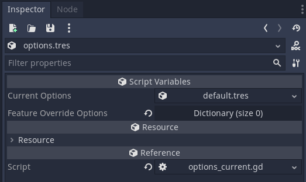
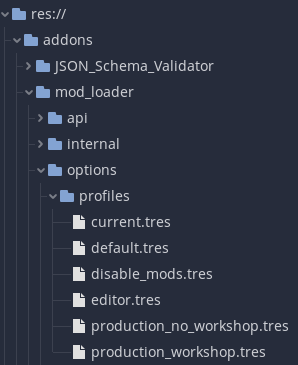

# Mod Loader Options
## Mod Loader Options
For easy configuration of the Mod Loader, you can use the options resource. Navigate to `res://addons/mod_loader/options` and double-click `options.tres` to open the resource editor.

## Available Options
| Option Name                        | Description                                                                                   |
|------------------------------------|-----------------------------------------------------------------------------------------------|
| enable_mods                        | Enable or disable loading of mods.                                                            |
| log_level                          | Set verbosity level for logs.                                                                 |
| locked_mods                        | List of mods that cannot be disabled or enabled in a user profile.                            |
| disabled_mods                      | List of mods not loaded on game restart.                                                      |
| allow_modloader_autoloads_anywhere | If true, ModLoaderStore and ModLoader Autoloads do not have to be the first Autoloads         |
| steam_workshop_enabled             | If true, ModLoader loads mod ZIPs from Steam workshop directory instead of default.           |
| override_path_to_mods              | Overrides path from which mods are loaded (default: "res://mods").                            |
| override_path_to_configs           | Overrides path from which mod configurations are loaded (default: "res://configs").           |
| override_path_to_workshop          | Overrides path to Steam workshop directory, for loading mods from there (editor use).         |
| ignore_deprecated_errors           | If true, deprecated functions trigger warning instead of fatal error.                         |
| ignored_mod_names_in_log           | List of mods whose messages should be ignored in the log.                                     |

## Profiles
You can find predefined option profiles in `res://addons/mod_loader/options/profiles`. These resource files can be dragged and dropped into the value field of a specific feature flag entry.

You can create your own option profiles by saving a `ModLoaderOptionsProfile` resource. One way to do this is to duplicate one of the existing profiles:

Right-click -> Duplicate...

Give it a new name

Now you can edit it to your liking by double-clicking it in the file dialog

## Feature Override Options (Feature Tags)
*Introduced in v6.2.0*

If you have a specific feature tag that should use different settings, you can set them as a key-value pair here. The most common use case is to use different settings when in the editor - using the `editor` tag - that's why it is already set as an override by default.

Another use case is managing multiple release platforms - Steam and others. In that case, you would define a custom feature tag for steam, add it as override and enable steam workshop in the corresponding options. Of course you can also use steam workshop as default and disable it otherwise though.

To add another override, add a new entry to the dictionary.
- Select `String` as type for the key and enter one of [Godot's feature tags](https://docs.godotengine.org/en/3.5/tutorials/export/feature_tags.html) or one you have defined yourself.
- Select `Resource` as type for the value and drag one of the available `ModLoaderOptionsProfile` resources into the field.

???+ note 
     Be careful with "overlapping" feature tags. Since dictionaries are not ordered, we cannot guarantee the order of two overrides being applied. If, for example both Windows and release define an override, the result is not predictable.