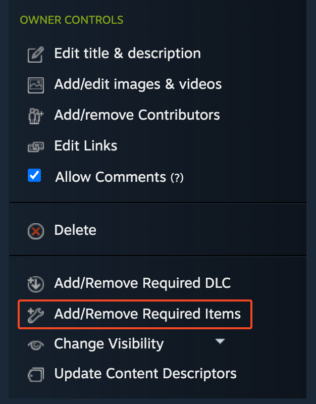

# Using Other Mods

There are many ways to use and interact with other mods - and most of them require the other mod to be present.
Dependencies are how you can ensure that it is always the case.

## Dependencies and Load Order

GML has a dependency system that allows your mod to safely interact and depend on other mods without causing
accidental game crashes. There are multiple types of dependencies you can use for your mod, but all of them are
set from the [`manifest.json`](mod_files.md#manifestjson).

### Standard Dependencies

Adding another mod's mod ID to the `dependencies` list in your manifest denotes that the other mod is 
required for your mod to work. If the other mod is not present at all or was disabled by the user, your 
mod will automatically be disabled by the mod loader too. 

If your mod depends on another mod, it will always be loaded after the other mod, so everything is initialized by the
time you access it.

### Optional Dependencies

Adding `optional_dependencies` in the `extra` section will only cause your mod to be loaded after other 
mods you add to the list, but it will not cause your mod to be disabled when any other mod is 
not present or not loaded. 

This is useful when you want to change the behaviour of another mod to fit better with your own, or to increase 
compatibility. To ensure that you can access the other mod, you should check 
[`#!gd ModLoaderMod.is_mod_active()`](../../api/mod_loader_mod.md#method-is_mod_active) before you access 
anything specific to that mod.

### Load Before

Sometimes, when modding other mods, you will need your mod to load before another mod - for example, when both mods
are planning to replace one specific asset, the first one loaded will apply. For this, you can add the other mod's ID
to your `load_before` list and your mod will be loaded first. Note that you can't load before and depend on the same
mod simultaneously.

## Distribution With Dependencies

Depending on how you share your mod with others, you will have to make sure that mod users get all dependencies they
need for your mod to work.

### Steam Workshop

Steam Workshop allows you to add other Steam Workshop items as "required items". If you add another mod here,
it will automatically be downloaded when someone subscribes to your mod.

 
{ .half-width .center }

### Thunderstore

Thunderstore packages also have a manifest.json at the root, but their dependencies require a specific mod 
version to be set in the following format `{namespace}-{name}-{version}`, e.g. `GodotModding-ExampleMod-2.1.4`
