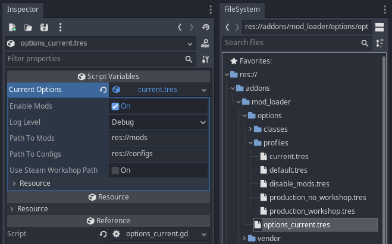

# Upcoming Features
This page cover features that are currently only on the [development](https://github.com/GodotModding/godot-mod-loader/tree/development) branch.

When features here are merged into [main](https://github.com/GodotModding/godot-mod-loader/tree/main) and published in a [release](https://github.com/GodotModding/godot-mod-loader/releases), their content will be moved to the proper location.

## Table of Contents
* [#145](https://github.com/GodotModding/godot-mod-loader/pull/145) - [Options](#options)
* [#142](https://github.com/GodotModding/godot-mod-loader/pull/142) - [Config JSON](#config-json)
* [#143](https://github.com/GodotModding/godot-mod-loader/pull/143) - [Saving](#saving)
* [TODO](#todo)

## Options
*via: [PR #145](https://github.com/GodotModding/godot-mod-loader/pull/145)*

You can change various ModLoader options through Godot's own GUI. In mod_loader/options there's a file called options_current.tres. You can edit the profile by either clicking on it in the options_current.tres file (as shown below), or by editing the currently active profile in the `profiles` directory.



The directory called profiles has various option `profiles` that you can quickly swap between. The profile named `current` is used by default. To use a different profile, drag an drop it onto the box labelled "Current Options" in options_current.tres.

?> At time of writing, only 1 option is supported (`enable_mods`). This will change as the Options feature is developed further.


## Config JSON
*via: [PR #142](https://github.com/GodotModding/godot-mod-loader/pull/142)*

### is_mod_config_data_valid
Pass the entire object retrieved via `get_mod_config` to check if it's valid, ie. to check that no errors occurred when reading the data.

Requires the full config object, not just the data dictionary from `get_mod_config().data`.

```gdscript
is_mod_config_data_valid(config_obj)

func is_mod_config_data_valid(
	# The full config object
	config_obj: Dictionary

# True if valid, false otherwise
) -> bool
```

#### Example
```gdscript
var config_obj = ModLoader.get_mod_config("AuthorName-ModName")
var is_valid = ModLoader.is_mod_config_data_valid(config_obj)
```


### save_mod_config_dictionary
Saves a full dictionary object to a custom mod config file, overwriting any existing file and file contents. Creates the file if it doesn't already exist.

```gdscript
save_mod_config_dictionary(mod_id, key, value, update_config)

func save_mod_config_dictionary(
	# Mod ID
	mod_id: String,

	# The full config dictionary
	data: Dictionary,

	# Value to assign to the key
	value,

	# If true, the config data held in memory will be updated too
	update_config: bool = true

# True if saving succeeded, false on error
) -> bool
```

#### Example
```gdscript
var mod_id = "AuthorName-ModName"
var my_dictionary = {
	"foo": "bar",
	"number": 9
}
ModLoader.save_mod_config_dictionary(mod_id, my_dictionary )
```


### save_mod_config_setting
Saves a single setting to a custom mod config file, overwriting any existing file and file contents. Creates the file if it doesn't already exist.

```gdscript
save_mod_config_setting(mod_id, key, value, update_config)

func save_mod_config_setting(
	# Mod ID
	mod_id: String,

	# Key to update
	key:String,

	# Value to assign to the key
	value,

	# If true, the config data held in memory will be updated too
	update_config: bool = true

# True if saving succeeded, false on error
) -> bool
```

#### Example
```gdscript
var mod_id = "AuthorName-ModName"
var my_key = "foo"
var my_val = "bar"
ModLoader.save_mod_config_setting(mod_id, my_key, my_val)
```


## Saving
*via [PR #143](https://github.com/GodotModding/godot-mod-loader/pull/143)*

There are 2 methods you can use to save data to a file:

### save_string_to_file
```gdscript
save_string_to_file(save_string, filepath)

func save_string_to_file(
	save_string: String,
	filepath: String
) -> bool
```

#### Example
```gdscript
var my_string = "hello world"
ModLoader.save_string_to_file(my_string, "user://custom_1.txt")
```


### save_dictionary_to_json_file
```gdscript
save_dictionary_to_json_file(data, filepath)

func save_dictionary_to_json_file(
	data: Dictionary,
	filepath: String
) -> bool
```

#### Example
```gdscript
var my_dictionary = {
	"foo": "bar"
}
ModLoader.save_dictionary_to_json_file(my_dictionary, "user://custom_2.json")
```

## TODO
These features have been merged into main and released, but there's no documentation for them yet.

### overwrites.gd
See: [PR #71](https://github.com/GodotModding/godot-mod-loader/pull/74) + [issue #14](https://github.com/GodotModding/godot-mod-loader/issues/14)
